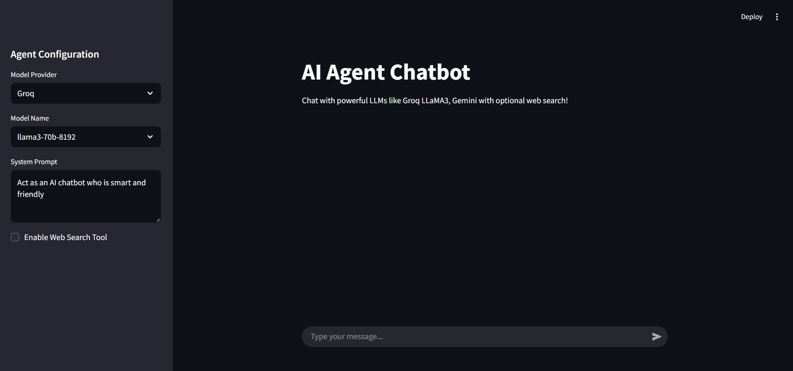
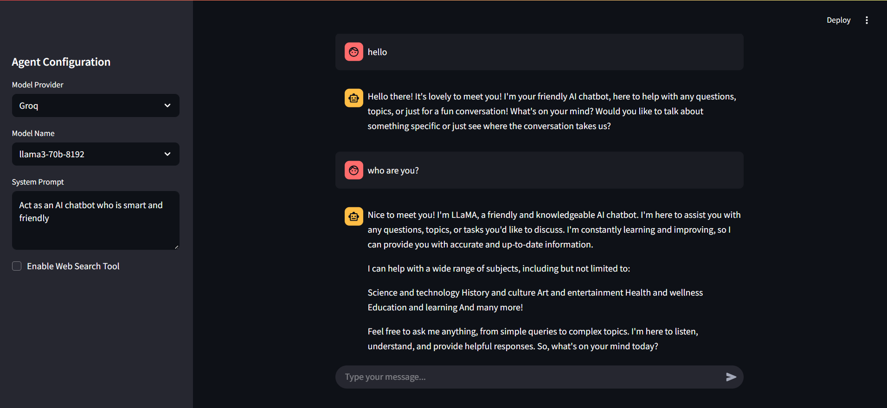

# 🤖 AI Agent Chatbot

A multi-model conversational AI chatbot built with powerful tools like Streamlit, LangChain, LangGraph, and FastAPI. This project allows users to chat with various LLMs and optionally enable web search capabilities.




## 🚀 Features

- Chat with multiple large language models **(LLMs)**
- **System prompt customization**
- **Optional web search tool** for real-time info
- **Persistent** chat history in session
- **Model selection** and **configuration** via sidebar


## 🧠 Tech Stack

| Tool/Library     | Purpose                                |
|------------------|----------------------------------------|
| **Python**       | Core programming language              |
| **Streamlit**    | Frontend for interactive chatbot UI    |
| **FastAPI**      | Backend API for model communication    |
| **LangChain**    | Framework for LLM orchestration        |
| **LangGraph**    | Graph-based agent decision logic       |


## ⚙️ Setup Instructions

### 1. Clone the Repository
```sh
git clone https://github.com/Balaji-R-05/ai-agent-chatbot.git
cd ai-agent-chatbot
```
### 2. Create Virtual Env and Install Dependencies
```sh
python -m venv venv
pip install -r requirements.txt
```

### 3. Start Backend (FastAPI)
```sh
uvicorn main:app --reload --port 8000
```

### 4. Start Frontend (Streamlit)
```sh
streamlit run client/app.py
```