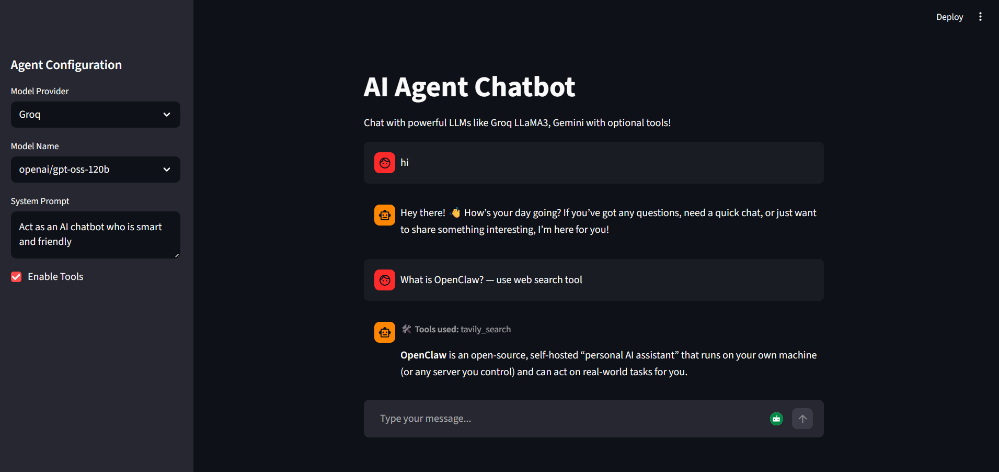
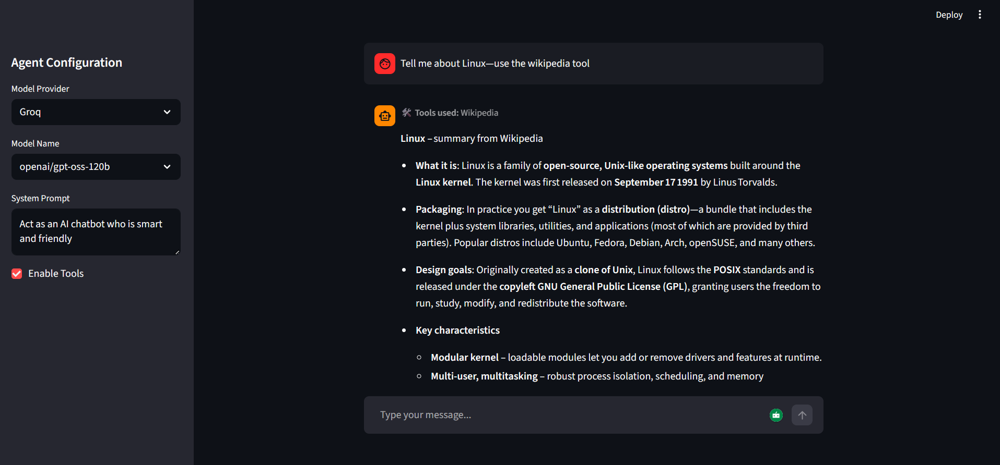
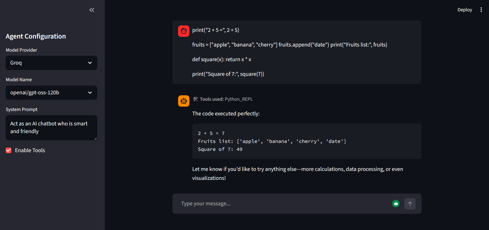

# AI Agent Chatbot

A multi-model conversational AI chatbot built with powerful tools like **Streamlit, LangChain, LangGraph, and FastAPI**. This project allows users to chat with various LLMs and optionally enable advanced tools like Web Search, Wikipedia, and a Python REPL.

## ✨ Features

| Feature | Description |
| :--- | :--- |
| **Multi-Model Support** | Chat with Groq LLaMA3, Gemini, etc. |
| **Advanced Tools** | Web Search (Tavily), Wikipedia, Python REPL |
| **Smart Orchestration** | LangGraph-based tool decision logic |
| **Optimized Performance** | History Sliding Window & Recursion Limits |
| **Customization** | System Prompt & Custom Tools (`tools.py`) |

## 🛠️ Tech Stack

| Tool/Library | Purpose |
| :--- | :--- |
| **Python** | Core programming language |
| **Streamlit** | Interactive Frontend UI |
| **FastAPI** | Backend API communication |
| **LangChain** | Framework for LLM orchestration |
| **LangGraph** | AI Agent decision logic |

## Demo & Interfaces

<div align="center">
  
  
  
  
  
</div>

## Setup Instructions

### 1. Clone the Repository
```sh
git clone https://github.com/Balaji-R-05/ai-agent-chatbot.git
cd ai-agent-chatbot
```

### 2. Create Virtual Environment and Install Dependencies
```sh
python -m venv venv
.\venv\Scripts\activate
pip install -r requirements.txt
```

### 3. Configure Environment
Create a `.env` file in the root directory:
```env
GROQ_API_KEY=your_groq_key
TAVILY_API_KEY=your_tavily_key
```

### 4. Run the Application
You can use the provided batch script:
```sh
.\run.bat
```

Alternatively, start the backend and frontend separately:
```sh
# Terminal 1: Backend
uvicorn main:app --port 8000

# Terminal 2: Frontend
streamlit run client/app.py
```
**Backend API documentation is available at [http://127.0.0.1:8000/doc](http://127.0.0.1:8000/doc)**