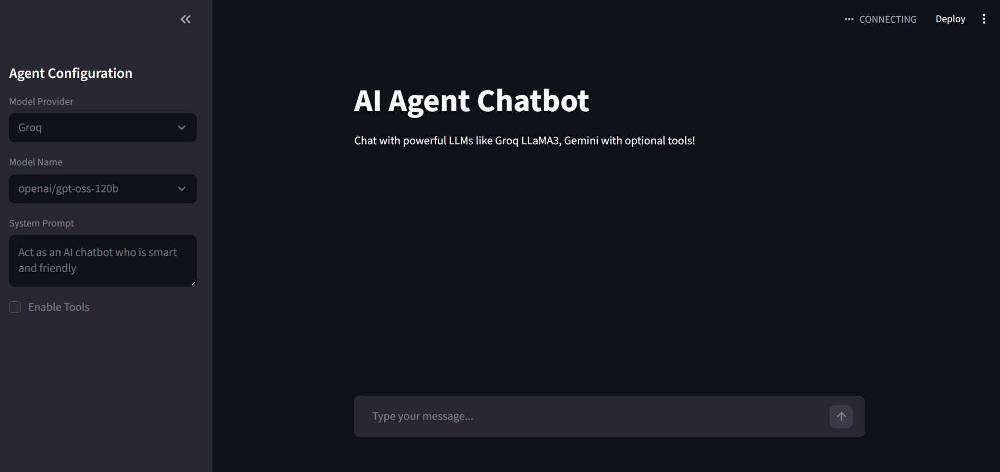
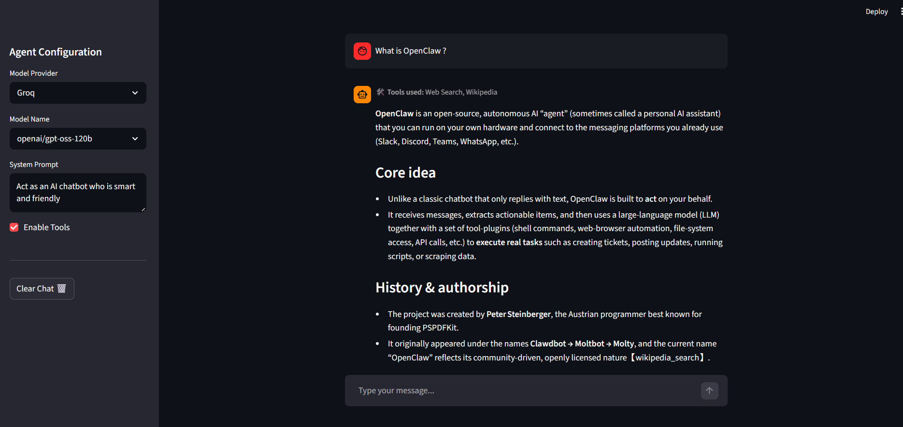
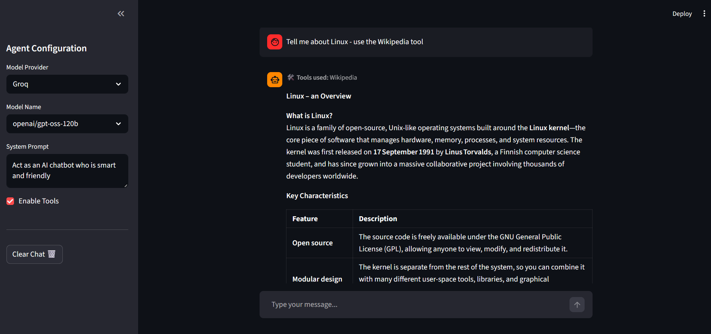
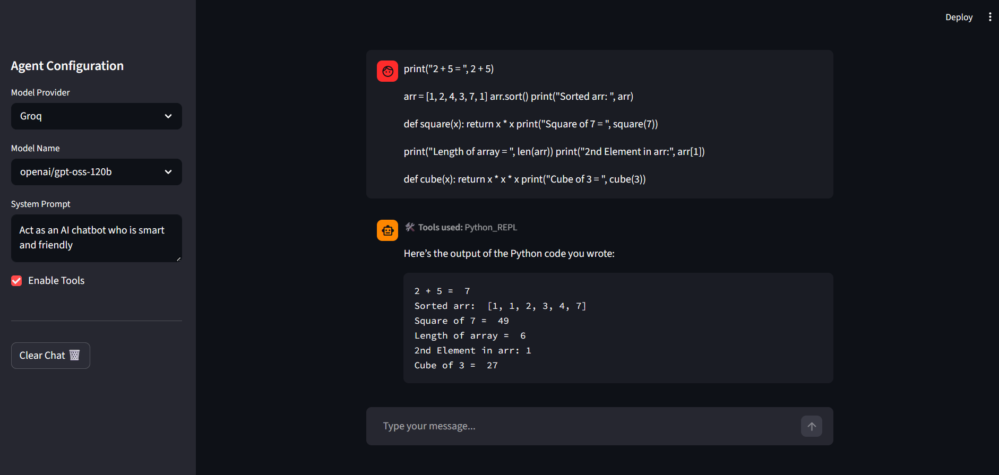
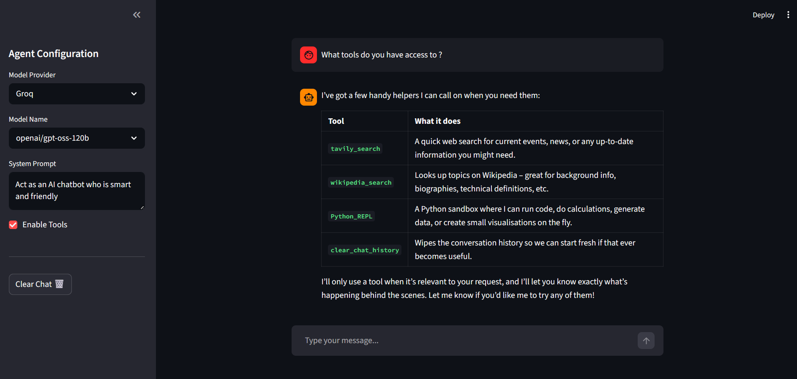

# AI Agent Chatbot

A multi-model conversational AI chatbot built with **Streamlit, LangChain, LangGraph, and FastAPI**. This project allows users to chat with various LLMs (Groq, Gemini, etc.) and enable advanced tools like **Web Search, Wikipedia,** and **Python REPL**.

<div align="center">
  
  
  
  
  
</div>

## ✨ Features

| Feature | Description |
| :--- | :--- |
| **Multi-Model Support** | Native support for Groq LLaMA3, Google Gemini (1.5 Pro/Flash, 2.5 Flash), and more. |
| **Advanced Tools** | Integrated Web Search (Tavily), Wikipedia, and Python REPL. |
| **Smart Orchestration** | Powered by **LangGraph** for robust tool-use decision logic. |
| **Dynamic Selection** | Intelligent model filtering based on chosen provider (Groq vs. Google). |
| **Auto-Clear Tool** | Integrated `clear_chat` tool allowing the AI to reset session history on request. |
| **Optimized Performance** | History sliding window & recursion limits for cost/speed efficiency. |
| **Customization** | Easily tailor system prompts and add custom tools in `tools.py`. |


## 🛠️ Tech Stack

| Tool/Library | Purpose |
| :--- | :--- |
| **Python** | Core logic and agent framework. |
| **Streamlit** | Sleek, interactive frontend for the chat interface. |
| **FastAPI** | High-performance backend API for model orchestration. |
| **LangChain** | The backbone for LLM integration and chaining. |
| **LangGraph** | State-of-the-graph logic for complex agentic workflows. |
| **Docker** | Containerization for easy deployment. |


## >_ Setup Instructions

### 1. Clone the Repository
```sh
git clone https://github.com/Balaji-R-05/ai-agent-chatbot.git
cd ai-agent-chatbot
```

### 2. Configure API Keys

Your `.env` should look like this:

```env
# Configuration
MAX_HISTORY=10
RECURSION_LIMIT=10            # Max steps before the agent stops

# LLM & Tool Keys
GROQ_API_KEY=your_groq_key
GEMINI_API_KEY=your_gemini_key
TAVILY_API_KEY=your_tavily_key

# Dev Configuration
BACKEND_URL="http://127.0.0.1:8000"
```

### 3. Run with Docker (Recommended)
The easiest way to run the application is using Docker Compose:
```sh
docker compose up --build
```
This will start both the backend (FastAPI) and the frontend (Streamlit).

### 4. Local Setup (Alternative)
#### Environment Setup
```sh
python -m venv venv
.\venv\Scripts\activate
pip install -r requirements.txt
```

#### Run the Application
Start both services using the batch script:
```sh
.\run.bat
```

Alternatively, start them separately:
```sh
# Terminal 1: Backend
uvicorn main:app --port 8000 --reload

# Terminal 2: Frontend
streamlit run client/app.py
```

---

- **API Documentation:** [http://127.0.0.1:8000/doc](http://127.0.0.1:8000/doc)
- **Streamlit App:** [http://127.0.0.1:8501](http://127.0.0.1:8501)

---
Developed by [Balaji-R-05](https://github.com/Balaji-R-05)
